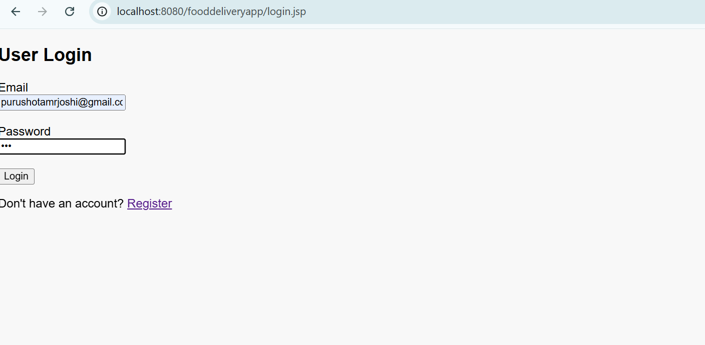
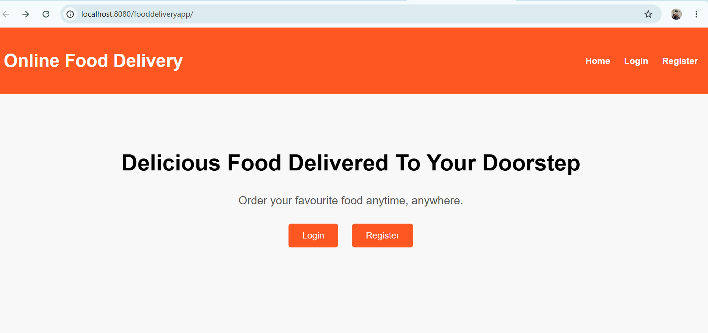
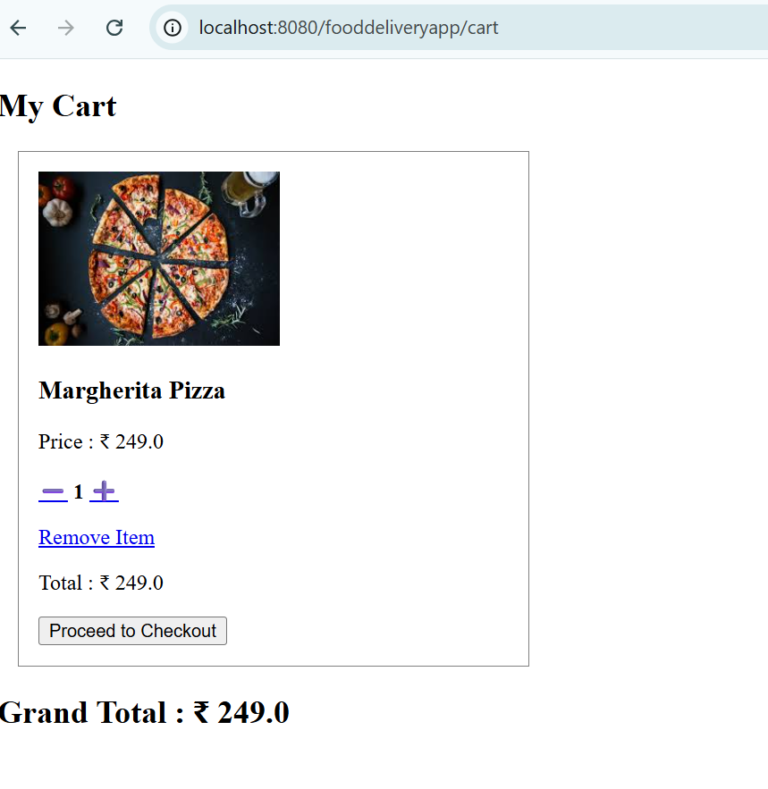
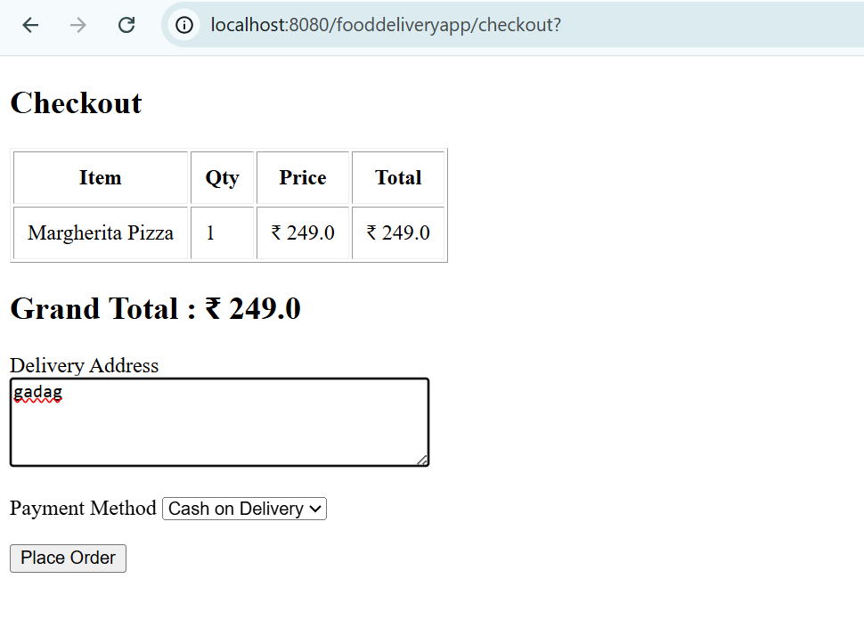
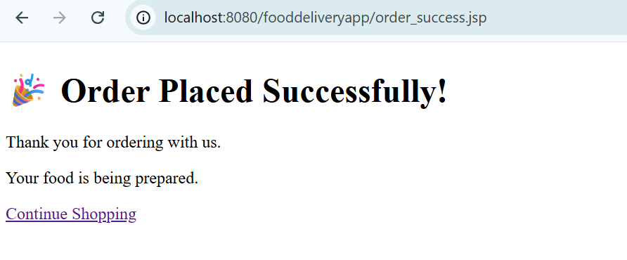

# 🍽️ Online Food Delivery System

A full-stack Java Web Application that allows users to browse restaurants, view menus, manage a shopping cart, and place food orders. This project is built using Java, JSP, Servlets, JDBC, MySQL, and Apache Tomcat following the MVC architecture.

---

## 📌 Project Overview

The Online Food Delivery System is designed to simulate a real-world food ordering platform. It provides a complete workflow from user registration and login to browsing restaurants, placing orders, and storing order details in a MySQL database.

---

## ✨ Features

### 👤 User Module
- User Registration
- User Login
- Session Management
- User Authentication

### 🍽️ Restaurant Module
- Display Available Restaurants
- Restaurant Images
- Restaurant Details
- View Restaurant Menu

### 🍕 Menu Module
- Display Food Items
- Food Images
- Price Display
- Add Items to Cart

### 🛒 Cart Module
- View Cart
- Increase Quantity
- Decrease Quantity
- Remove Item
- Grand Total Calculation

### 💳 Checkout Module
- Delivery Address
- Payment Method Selection
- Order Summary

### 📦 Order Module
- Place Order
- Store Order Details
- Store Order Items
- Clear Cart After Successful Order
- Order Success Page

---

## 🛠️ Technologies Used

### Backend
- Java
- JSP
- Servlets
- JDBC

### Frontend
- HTML
- CSS

### Database
- MySQL 8

### Server
- Apache Tomcat 10

### Build Tool
- Maven

### IDE
- Eclipse IDE for Enterprise Java and Web Developers

---

## 📂 Project Structure

```
OnlineFoodDelivery
│
├── src
│   ├── main
│   │   ├── java
│   │   │   ├── dao
│   │   │   ├── model
│   │   │   ├── servlet
│   │   │   └── util
│   │   │
│   │   └── webapp
│   │       ├── images
│   │       ├── login.jsp
│   │       ├── register.jsp
│   │       ├── home.jsp
│   │       ├── menu.jsp
│   │       ├── cart.jsp
│   │       ├── checkout.jsp
│   │       └── order_success.jsp
│
├── pom.xml
└── README.md
```

---

## 🗄️ Database Tables

- users
- restaurants
- menu
- cart
- orders
- order_items

---

## 🚀 Project Workflow

```
Register
      ↓
Login
      ↓
Browse Restaurants
      ↓
View Menu
      ↓
Add to Cart
      ↓
Manage Cart
      ↓
Checkout
      ↓
Place Order
      ↓
Order Success
```

---

## ⚙️ Installation

### Prerequisites

- Java JDK 21 or later
- Eclipse IDE
- Apache Tomcat 10
- MySQL 8
- Maven

### Steps

1. Clone the repository

```bash
git clone https://github.com/purushotamrjoshi/OnlineFoodDelivery.git
```

2. Import the project into Eclipse as an Existing Maven Project.

3. Create the MySQL database:

```sql
online_food_delivery
```

4. Import the SQL tables.

5. Update the database credentials in:

```
DBConnection.java
```

6. Configure Apache Tomcat.

7. Run the project.

---

## 📸 Screenshots

Add screenshots here after uploading them.

### Login Page



### Home Page



### Menu



### Cart


### Checkout



### Order Success



---

## 📈 Future Enhancements

- Admin Panel
- Restaurant Search
- Filter by Cuisine
- User Profile
- Order History
- Online Payment Integration
- Email Notifications
- Responsive UI
- Bootstrap UI
- Spring Boot Migration
- REST API Integration

---

## 🎯 Learning Outcomes

This project helped me understand:

- MVC Architecture
- JDBC Connectivity
- CRUD Operations
- Session Management
- JSP & Servlets
- MySQL Database Design
- Maven Project Structure
- Apache Tomcat Deployment
- Git & GitHub

---

## 👨‍💻 Author

**Purushotam R. Joshi**

GitHub: https://github.com/purushotamrjoshi

---

## ⭐ Support

If you found this project useful, consider giving it a ⭐ on GitHub.

---

## 📄 License

This project is developed for learning and educational purposes.
